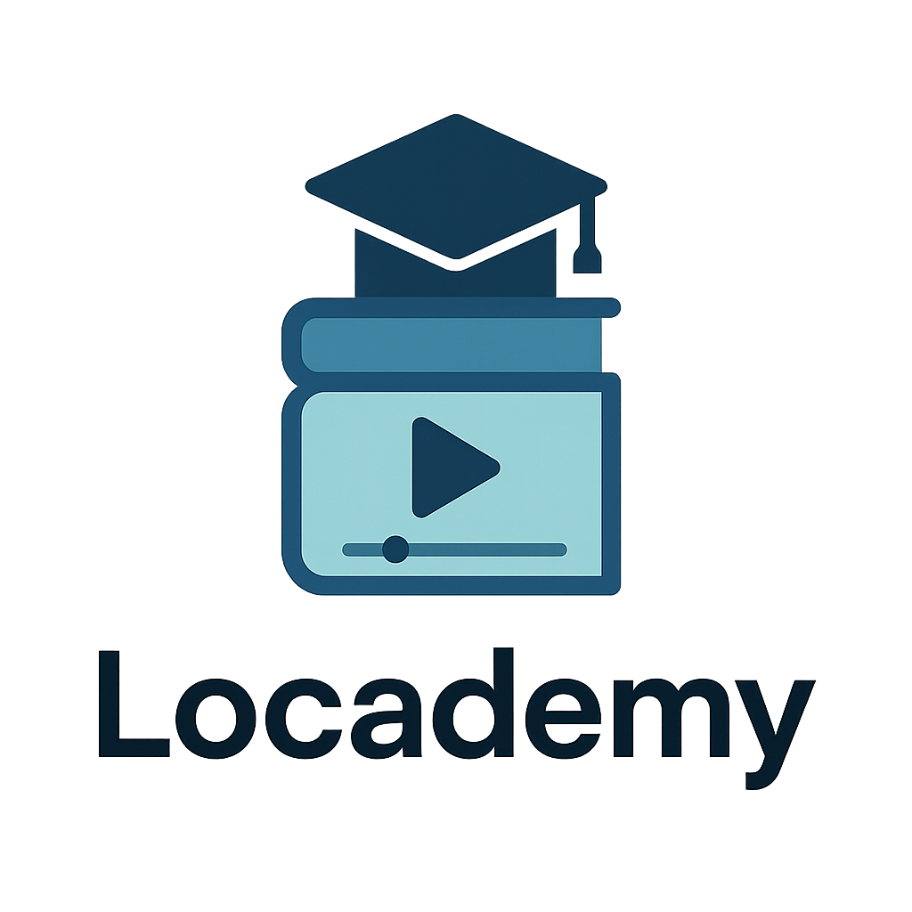

# Locademy

Locademy is a lightweight offline course video tracker.  
It lets you import course folders from your computer, organize them into courses/modules/videos, track your progress, and take notes — all stored locally in the browser.

---

## Features

- Import local course folders  
  Organizes by course → module → video automatically.

- Video playback with resume  
  Resume where you left off with saved progress.

- Completion tracking  
  Configurable thresholds (for example, 90% watched or last 30 seconds).

- Automatic thumbnails  
  Thumbnails generated on import.

- Notes per video  
  Markdown editor with live preview and autosave.

- Dashboard  
  Displays all courses with progress bars and a "Continue Watching" section.

- Offline-first  
  Uses IndexedDB and the File System Access API. Your files remain on disk.

---

## Tech Stack

- Frontend: React, TypeScript, Vite
- UI: Tailwind CSS, shadcn/ui
- Storage: IndexedDB (Dexie)
- File Access: File System Access API (Chromium) or classic file picker fallback
- Other: React Router, Markdown rendering

---

## Getting Started

### Prerequisites

- Node.js 18+
- pnpm (recommended) or npm

### Setup

```bash
# Install dependencies
pnpm install

# Start development server
pnpm dev

# Build for production
pnpm build

# Preview production build
pnpm preview
```

### Browser Support

- Chromium-based browsers (Chrome, Edge, Brave): full support with persistent file handles.
- Firefox and Safari: fallback mode with manual re-linking of files when required.

---

## Project Structure

```
src/
  components/    # Reusable UI and course components
  pages/         # Top-level routes (Dashboard, Course, Player, Settings)
  services/      # Business logic (import, progress, notes, thumbnails)
  state/         # React contexts (library, settings)
  lib/           # Utilities, database schema, constants
  hooks/         # Custom hooks
public/          # Static assets
```

---

## Development Notes

- Data is stored in IndexedDB (`src/lib/db.ts` manages schema via Dexie).
- The File System Access API is used where available; fallback file pickers ensure compatibility.
- Modules and videos are sorted by `order`, then numeric prefix in title, then alphabetically.
- Notes autosave with debounce and support GitHub-flavored Markdown.

---

## Future Plans

- Export/import course manifests for backup and restore
- Multi-user profiles
- Desktop packaging via Electron or Tauri
- Bookmarks and timestamps inside videos
- Analytics on watch time

---

## License

MIT License.  
Locademy is free to use and modify locally.
